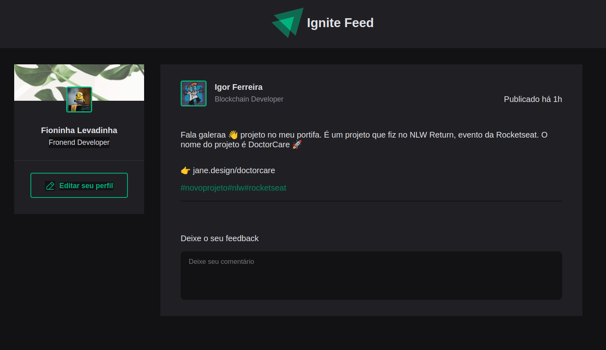
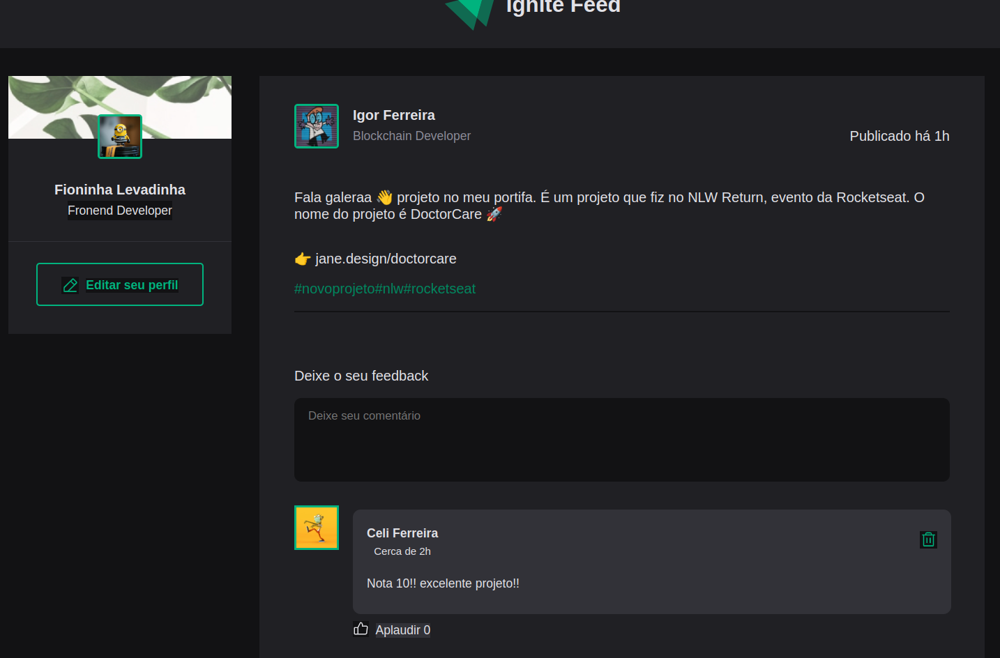

<h1>Projeto Feed Chat</h1>

<h2>Sobre o projeto</h2>

- O projeto é um chat aonde o usuário pode comentar o post principal.
- Dar like e deletar o comentário.

<h2>Principais functionalidades.</h2>
- Adicionar um post.
- Adicionar comentário(enviar um feedback).
- Dar like que aqui usamos o nome aplaudir.
- Deletar o comentário.

<h2>Desafios que encontrei no projeto</h2>

- Utilizar objecto no Javascript para inserir informacões automáticas.
- Fazer o feedback do usuário ser adicionado manual e o nome, avatar ser inserido automático.
- Deixar o botão oculto se não houver texto no textarea.
- Utilizar o styled components em vez do sass.

<h2>Tecnologias utilizadas:</h2>

- ReactJS
- styled-components
- phopos-icons react
- ViteJS

